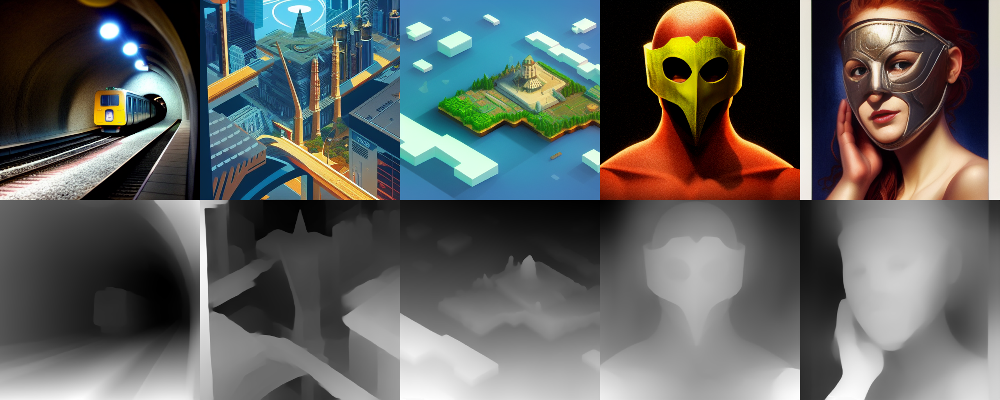
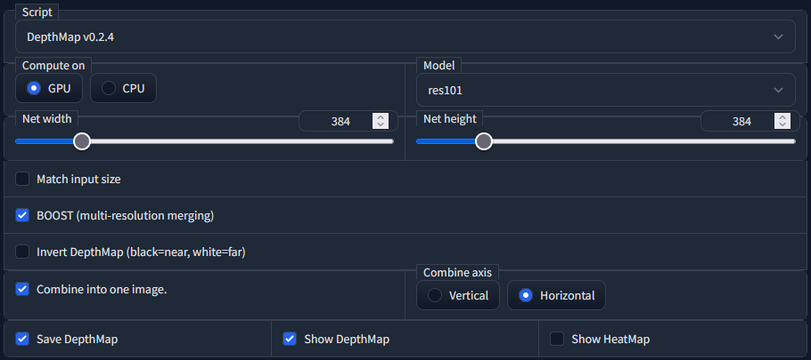

# High Resolution Depth Maps for Stable Diffusion WebUI
This script is an addon for [AUTOMATIC1111's Stable Diffusion WebUI](https://github.com/AUTOMATIC1111/stable-diffusion-webui) that creates `depth maps` and `stereo image pairs` as side-by-side or anaglyph from a single image. The result can be viewed on 3D or holographic devices like VR headsets or [Looking Glass](https://lookingglassfactory.com/) displays, used in Render- or Game- Engines on a plane with a displacement modifier, and maybe even 3D printed.

To generate realistic depth maps from a single image, this script uses code and models from the [MiDaS](https://github.com/isl-org/MiDaS) repository by Intel ISL (see [https://pytorch.org/hub/intelisl_midas_v2/](https://pytorch.org/hub/intelisl_midas_v2/) for more info), or LeReS from the [AdelaiDepth](https://github.com/aim-uofa/AdelaiDepth) repository by Advanced Intelligent Machines. Multi-resolution merging as implemented by [BoostingMonocularDepth](https://github.com/compphoto/BoostingMonocularDepth) is used to generate high resolution depth maps.

3D stereo, and red/cyan anaglyph images are generated using code from the [stereo-image-generation](https://github.com/m5823779/stereo-image-generation) repository. Thanks to [@sina-masoud-ansari](https://github.com/sina-masoud-ansari) for the tip! Discussion [here](https://github.com/thygate/stable-diffusion-webui-depthmap-script/discussions/45). Improved techniques for generating stereo images and balancing distortion between eyes by [@semjon00](https://github.com/semjon00), see [here](https://github.com/thygate/stable-diffusion-webui-depthmap-script/pull/51) and [here](https://github.com/thygate/stable-diffusion-webui-depthmap-script/pull/56).

## Examples
[](https://raw.githubusercontent.com/thygate/stable-diffusion-webui-depthmap-script/main/examples.png)

## Changelog
* v0.3.2 new feature and bugfixes
    * several bug fixes for apple silicon and other machines without cuda
    * NEW Stereo Image Generation techniques for gap filling by [@semjon00](https://github.com/semjon00) using polylines. (See [here](https://github.com/thygate/stable-diffusion-webui-depthmap-script/pull/56)) Significant improvement in quality.
* v0.3.1 bugfix
    * small speed increase for anaglyph creation
    * clone midas repo before midas 3.1 to fix issue (see [here](https://github.com/thygate/stable-diffusion-webui-depthmap-script/issues/55#issue-1510266008))
* v0.3.0 improved stereo image generation
    * New improved technique for generating stereo images and balancing distortion between eyes by [@semjon00](https://github.com/semjon00) (See [here](https://github.com/thygate/stable-diffusion-webui-depthmap-script/pull/51))
    * Substantial speedup of stereo image generation code using numba JIT
* v0.2.9 new feature 
    * 3D Stereo (side-by-side) and red/cyan anaglyph image generation.   
    (Thanks to [@sina-masoud-ansari](https://github.com/sina-masoud-ansari) for the tip! Discussion [here](https://github.com/thygate/stable-diffusion-webui-depthmap-script/discussions/45))
* v0.2.8 bugfix
    * boost (pix2pix) now also able to compute on cpu
    * res101 able to compute on cpu
* v0.2.7 separate tab
    * Depth Tab now available for easier stand-alone (batch) processing
* v0.2.6 ui layout and settings
    * added link to repo so more people find their way to the instructions.
    * boost rmax setting
* v0.2.5 bugfix
    * error checking on model download (now with progressbar)
* v0.2.4 high resolution depthmaps
    * multi-resolution merging is now implemented, significantly improving results!
    * res101 can now also compute on CPU
* v0.2.3 bugfix
    * path error on linux fixed
* v0.2.2 new features
    * added (experimental) support for AdelaiDepth/LeReS (GPU Only!)
    * new option to view depthmap as heatmap
    * optimised ui layout
* v0.2.1 bugfix
    * Correct seed is now used in filename and pnginfo when running batches. (see [issue](https://github.com/thygate/stable-diffusion-webui-depthmap-script/issues/35))
* v0.2.0 upgrade
    * the script is now an extension, enabling auto installation.
* v0.1.9 bugfixes
    * sd model moved to system memory while computing depthmap
    * memory leak/fragmentation issue fixed
    * recover from out of memory error
* v0.1.8 new options
    * net size can now be set as width and height, option to match input size, sliders now have the same range as generation parameters. (see usage below)
    * better error handling
* v0.1.7 bugfixes
    * batch img2img now works (see [issue](https://github.com/thygate/stable-diffusion-webui-depthmap-script/issues/21#issuecomment-1306445056))
    * generation parameters now only saved when enabled in settings
    * model memory freed explicitly at end of script
* v0.1.6 new option
    * option to invert depthmap (black=near, white=far), as required by some viewers.
* v0.1.5 bugfix
    * saving as any format other than PNG now always produces an 8 bit, 3 channel RGB image. A single channel 16 bit image is only supported when saving as PNG. (see [issue](https://github.com/thygate/stable-diffusion-webui-depthmap-script/issues/15#issuecomment-1304909019))
* v0.1.4 update
    * added support for `--no-half`. Now also works with cards that don't support half precision like GTX 16xx. ([verified](https://github.com/thygate/stable-diffusion-webui-depthmap-script/issues/12#issuecomment-1304656398))
* v0.1.3 bugfix
    * bugfix where some controls where not visible (see [issue](https://github.com/thygate/stable-diffusion-webui-depthmap-script/issues/11#issuecomment-1304400537))
* v0.1.2 new option
    * network size slider. higher resolution depth maps (see usage below)
* v0.1.1 bugfixes
    * overflow issue (see [here](https://github.com/thygate/stable-diffusion-webui-depthmap-script/issues/10) for details and examples of artifacts)
    * when not combining, depthmap is now saved as single channel 16 bit

## Install instructions
The script is now also available to install from the `Available` subtab under the `Extensions` tab in the WebUI.

⚠️ Restart the backend after first install or it won't find the newly cloned repositories !

### Updating
In the WebUI, in the `Extensions` tab, in the `Installed` subtab, click `Check for Updates` and then `Apply and restart UI`.

### Automatic installation 
In the WebUI, in the `Extensions` tab, in the `Install from URL` subtab, enter this repository 
`https://github.com/thygate/stable-diffusion-webui-depthmap-script`
 and click install.

>The midas repository will be cloned to /repositories/midas

>The BoostingMonocularDepth repository will be cloned to /repositories/BoostingMonocularDepth

>Model `weights` will be downloaded automatically on first use and saved to /models/midas, /models/leres and /models/pix2pix


## Usage
Select the "DepthMap vX.X.X" script from the script selection box in either txt2img or img2img, or go to the Depth tab.


The models can `Compute on` GPU and CPU, use CPU if low on VRAM. 

There are five models available from the `Model` dropdown, the first four are the midas models: dpt_large, dpt_hybrid, midas_v21, and midas_v21_small. The first one dpt_large is the most recent midas model. See the [MiDaS](https://github.com/isl-org/MiDaS) repository for more info. The dpt_hybrid model yields good results in my experience, and is much smaller than the dpt_large model, which means shorter loading times when the model is reloaded on every run.
For the fifth model, res101, see [AdelaiDepth/LeReS](https://github.com/aim-uofa/AdelaiDepth/tree/main/LeReS) for more info.

Net size can be set with `net width` and `net height`, or will be the same as the input image when `Match input size` is enabled. There is a trade-off between structural consistency and high-frequency details with respect to net size (see [observations](https://github.com/compphoto/BoostingMonocularDepth#observations)). Large maps will also need lots of VRAM.

`Boost` will enable multi-resolution merging as implemented by [BoostingMonocularDepth](https://github.com/compphoto/BoostingMonocularDepth) and will significantly improve the results. Mitigating the observations mentioned above. Net size is ignored when enabled. Best results with res101.

When enabled, `Invert DepthMap` will result in a depthmap with black near and white far.

Regardless of global settings, `Save DepthMap` will always save the depthmap in the default txt2img or img2img directory with the filename suffix '_depth'. Generation parameters are saved with the image if enabled in settings. Files generated from the Depth tab are saved in the default extras-images directory.

To see the generated output in the webui `Show DepthMap` should be enabled. When using Batch img2img this option should also be enabled.

To make the depthmap easier to analyze for human eyes, `Show HeatMap` shows an extra image in the WebUI that has a color gradient applied. It is not saved.

When `Combine into one image` is enabled, the depthmap will be combined with the original image, the orientation can be selected with `Combine axis`. When disabled, the depthmap will be saved as a 16 bit single channel PNG as opposed to a three channel (RGB), 8 bit per channel image when the option is enabled.

When either `Generate Stereo` or `Generate anaglyph` is enabled, a stereo image will be generated. The `IPD`, or Pupillary distance is given in centimeter along with the `Screen Width`.

> 💡 Saving as any format other than PNG always produces an 8 bit, 3 channel RGB image. A single channel 16 bit image is only supported when saving as PNG.

## FAQ

 * `Can I use this on existing images ?`
    - Yes, you can now use the Depth tab to easily process existing images.
    - Yes, in img2img, set denoising strength to 0. This will effectively skip stable diffusion and use the input image. You will still have to set the correct size, and need to select `Crop and resize` instead of `Just resize` when the input image resolution does not match the set size perfectly.
 * `Can I run this on google colab ?`
    - You can run the MiDaS network on their colab linked here https://pytorch.org/hub/intelisl_midas_v2/
    - You can run BoostingMonocularDepth on their colab linked here : https://colab.research.google.com/github/compphoto/BoostingMonocularDepth/blob/main/Boostmonoculardepth.ipynb

## Viewing

### For viewing on 2D displays

* There is the excellent [depthy](https://github.com/panrafal/depthy) by Rafał Lindemann. LIVE link : [https://depthy.stamina.pl/](https://depthy.stamina.pl/)
(Instructions: Drag the rgb image into the window, then select Load depthmap, and drag the depthmap into the dialog inside the window.) Generates GIF and video.

* The [depth-player](https://github.com/spite/depth-player) by [@spite](https://github.com/spite) can load rgb and depthmap images and export a Wavefront OBJ file of a displaced plane mesh with the rgb image applied as texture. LIVE link : [https://depthplayer.ugocapeto.com/](https://depthplayer.ugocapeto.com/) Thanks to [@AugmentedRealityCat](https://github.com/AugmentedRealityCat) for the tip.

* Simple interactive depthmap viewer using three ([source](https://github.com/thygate/depthmap-viewer-three)). LIVE link : [https://thygate.github.io/depthmap-viewer-three](https://thygate.github.io/depthmap-viewer-three) (Instructions: Drag a combined-rgb-and-depth-horizontally image into the window to view it)

### For viewing on 3D devices

* Simple interactive depthmap viewer for Looking Glass using three. LIVE link : [https://thygate.github.io/depthmap-viewer-three-lookingglass](https://thygate.github.io/depthmap-viewer-three-lookingglass) (Instructions: Drag a combined-rgb-and-depth-horizontally image into the window to view it)

* Unity3D project to view the depthmaps on Looking Glass in realtime as images are generated. Leave a message in the discussion section if you want me to publish it too.

### Blender
* Blender depthmap import addon by [@Ladypoly](https://github.com/LadyPoly) ([comment](https://github.com/AUTOMATIC1111/stable-diffusion-webui/discussions/4252#discussioncomment-4333661)).   
Download the addon here : [importdepthmap_1.0.3.zip](https://github.com/AUTOMATIC1111/stable-diffusion-webui/files/10194086/importdepthmap_1.0.3.zip) (Blender 3.3.0 or newer)   
Demonstration videos : (1) https://www.youtube.com/watch?v=vfu5yzs_2EU , (2) https://www.youtube.com/watch?v=AeDngG9kQNI  

    [](https://www.youtube.com/watch?v=vfu5yzs_2EU) [](https://www.youtube.com/watch?v=AeDngG9kQNI)


## Forks and Related
* Generate normal maps from depth maps : [stable-diffusion-webui-normalmap-script](https://github.com/graemeniedermayer/stable-diffusion-webui-normalmap-script) by [@graemeniedermayer](https://github.com/graemeniedermayer)

* Several scripts by [@Extraltodeus](https://github.com/Extraltodeus) using depth maps : https://github.com/Extraltodeus?tab=repositories

### More updates soon .. Feel free to comment and share in the discussions. 

## Acknowledgements

This project uses code and information from following papers :

MiDaS :

```
@article {Ranftl2022,
    author  = "Ren\'{e} Ranftl and Katrin Lasinger and David Hafner and Konrad Schindler and Vladlen Koltun",
    title   = "Towards Robust Monocular Depth Estimation: Mixing Datasets for Zero-Shot Cross-Dataset Transfer",
    journal = "IEEE Transactions on Pattern Analysis and Machine Intelligence",
    year    = "2022",
    volume  = "44",
    number  = "3"
}
```

Dense Prediction Transformers, DPT-based model :

```
@article{Ranftl2021,
	author    = {Ren\'{e} Ranftl and Alexey Bochkovskiy and Vladlen Koltun},
	title     = {Vision Transformers for Dense Prediction},
	journal   = {ICCV},
	year      = {2021},
}
```

AdelaiDepth/LeReS :

```
@article{yin2022towards,
	title={Towards Accurate Reconstruction of 3D Scene Shape from A Single Monocular Image},
	author={Yin, Wei and Zhang, Jianming and Wang, Oliver and Niklaus, Simon and Chen, Simon and Liu, Yifan and Shen, Chunhua},
	journal={TPAMI},
	year={2022}
}
@inproceedings{Wei2021CVPR,
	title     =  {Learning to Recover 3D Scene Shape from a Single Image},
	author    =  {Wei Yin and Jianming Zhang and Oliver Wang and Simon Niklaus and Long Mai and Simon Chen and Chunhua Shen},
	booktitle =  {Proc. IEEE Conf. Comp. Vis. Patt. Recogn. (CVPR)},
	year      =  {2021}
}
```

Boosting Monocular Depth Estimation Models to High-Resolution via Content-Adaptive Multi-Resolution Merging :

```
@inproceedings{Miangoleh2021Boosting,
	title={Boosting Monocular Depth Estimation Models to High-Resolution via Content-Adaptive Multi-Resolution Merging},
	author={S. Mahdi H. Miangoleh and Sebastian Dille and Long Mai and Sylvain Paris and Ya\u{g}{\i}z Aksoy},
	journal={Proc. CVPR},
	year={2021},
}
```
